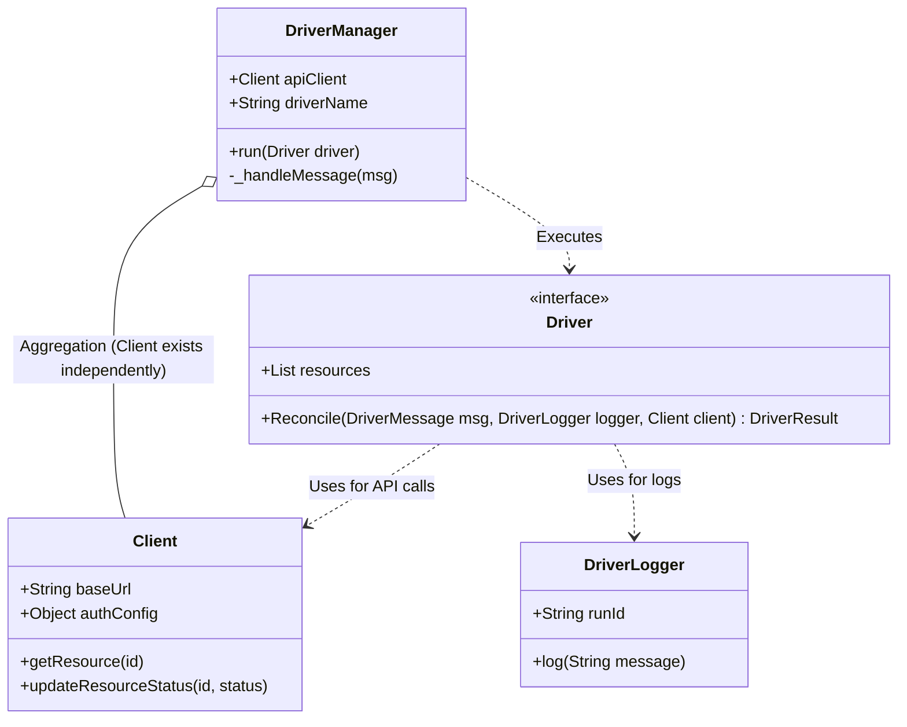
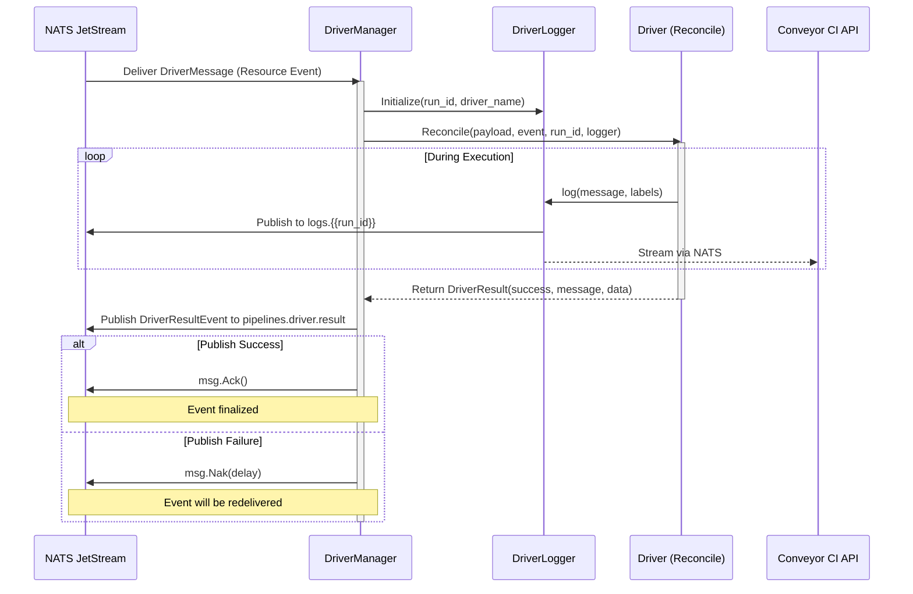

Conveyor CI Client SDKs/Libraries Software Design Document. This document serves as a reference for implementing Client SDK libraries for Conveyor CI.

<!-- truncate -->

---

## 1. Introduction

### 1.1 Document Purpose

This Software Design Document (SDD) defines the architecture of the Conveyor CI Driver Runtime. It serves as a reference for developers and engineers who would like to implement, manatain and contribute to a languange specific runtime by describing how the runtime works, how its cmponents interact with each other and the COnveyor CI system and the desgin decisions behind it.
This document is primarily intended for developers building or maintaining Conveyor CI Driver SDKs across different programming languages.

### 1.2 Subject Scope

The Conveyor CI Driver Runtime is a runtime architecture used to execute Conveyor CI Drivers that provides a shared standard protocal and utilities such as event handling, logging, scaling, and API communication, allowing driver authors to focus on domain-specific logic.
This SDD focuses on that **runtime layer**, not individual driver implementations or the Conveyor CI API Server itself.

**In scope**

* Runtime architecture and components
* Event-driven execution model
* Driver lifecycle

**Out of scope**

* Conveyor CI core scheduler
* Language-specific SDK syntax

### 1.3 Definitions

| Term        | Definition                                                           |
| ----------- | -------------------------------------------------------------------- |
| CI          | Continuous Integration                                               |
| Driver      | A program that reacts to Conveyor CI events and reconciles resources |
| Runtime     | Execution environment that hosts and manages drivers                 |
| JetStream   | NATS persistence and streaming subsystem                             |
| `Reconcile` | Driver-defined function invoked per event                            |

### 1.4 References

* Conveyor CI Documentation -  Informative - [https://conveyor.open.ug/docs/introduction](https://conveyor.open.ug/docs/introduction)
* NATS & JetStream Documentation - Normative - [https://docs.nats.io/](https://docs.nats.io/)
* Conveyor CI GitHub Repository - Normative - [https://github.com/open-ug/conveyor](https://github.com/open-ug/conveyor)

## 2. Design Overview

### 2.1 Stakeholder Concerns

| Stakeholder            | Concerns                                  |
| ---------------------- | ----------------------------------------- |
| Driver Developers      | Ease of use, stable APIs, observability   |
| Runtime Maintainers    | Modularity, testability, scalability      |
| Platform Operators     | Reliability, performance, fault isolation |
| Ecosystem Contributors | Language portability, clear abstractions  |

### 2.2 Selected Viewpoints

The following viewpoints are used to describe the system:

* **Context View** – Defines system boundaries
* **Composition View** – Shows major runtime components
* **Interaction View** – Explains runtime behavior
* **Information View** – Describes event and log data
* **Deployment View** – Describes execution topology

## 3. Design Views

### 3.1 Context View

**Viewpoint:** Context
The Driver Runtime operates as an execution environment between Conveyor CI infrastructure (API Server and NATS Server) and user-defined Drivers.

**External Actors**

* Conveyor CI API Server
* NATS JetStream
* Driver Developer Code

**Responsibility**

* Receive events from NATs
* Execute driver logic by invoking the `Reconcile` function eachtime an event is recieved.
* Collect logs and result state and send them to Conveyor CI API server
* Handle Authentication.


### 3.2 Composition View

**Viewpoint:** Composition

The runtime is composed of the following primary components:

* **Driver Manager**
* **Driver Logger**
* **Driver**
* **API Client Library**

Each component is designed to be replaceable and portable across languages.

### 3.3 Logical View

The logical architecture defines the core abstractions that must be implemented in every language-specific SDK. This structure ensures that regardless of the language, the Driver author interacts with the system through a consistent set of interfaces.

#### 3.3.1 Component Responsibilities

| Component      | Role                    | Primary Responsibilities                                                                      | Lifecycle / Scope           |
| -------------- | ----------------------- | --------------------------------------------------------------------------------------------- | --------------------------- |
| Driver Manager | Orchestrator            | Manages NATS/JetStream connections; creates consumers; executes the "Try-Catch-Ack" loop.     | Global (Runtime duration)   |
| Driver         | User Logic              | Defines resource filters; implements the domain-specific `Reconcile` logic.                   | Global (User-defined)       |
| Driver Logger  | Contextual Logger       | Enforces structured logging; automatically attaches `run_id`, `driver_name`, and `timestamp`. | Per-Event (`run_id` scoped) |
| Client         | A stateless HTTP client | Provides typed methods for REST API interaction (Secrets, Status updates, Metadata).          | Standalone / Reusable       |


#### 3.3.2 Class Diagram (UML)



### 3.4 Interaction View

**Viewpoint:** How compenents interact with each other.

**Typical Flow**

1. When the Driver manager starts, it creates a Jetstream connection to Conveyor CI's NATs Server.
2. It then uses that JetStream Connection to create a consumer listening on the `messages` stream. Depending on the drivers name and resources the driver specified, it filters to listem for events sent on the following subjects:
   1. `resources.{{resource}}`: with `{{resource}}` being a place holder for the resource name the driver defines to listen to.
   2. `drivers.{{driver_name}}.resources.{{resource}}`: with `{{driver_name}}` and `{{resource}}` being placeholders for the drivers name and the resource name the driver defines to listen to respectively.
3. **AckPolicy** should be set to `AckExplicitPolicy` and **DeliverPolicy** should be set to `DeliverAllPolicy`
4. Driver Manager consumer receives event. The payload/event data is of JSON format following the [Driver Message](#driver-message) schema
5. When an event is recieved, a Driver logger is initialized, and this will be provided to the driver's `Reconcile` function as a parameter. It has default set labels that will be appended t each log message and these include:
   1. `run_id`: Which is a UUID string that can be accessed by from the event data
6. Driver `Reconcile()` invoked with paramenters, `Reconcile(message.Payload, message.Event, message.RunID, logger)` is `message` is considered as the event data recieved.
7. The Driver logger has a `log()` method that allows the driver to send logs that are to be persisited by conveyor CI, this method takes in the log message and any other custom labels that would like to be attached to the log message.
8. The driver logger then uses the drive managers, NATs and Jetstream connections to publish this log data to `logs.{{RUN ID}}` subject using JetStream and also send a plain NATs `driver:{{DRIVER_NAME}}:logs:{{RUN ID}}` subject using NATs. Before sending this data it should encode it to JSON aligining with the [Log Entry](#log-entry) schema.
9. Once the Reconcile function is done running, its expected to return a result of its execution, of schema [Driver Result](#driver-result) and this data will be published over Jetstream to the `pipelines.driver.result` subject as a [Driver Result Event](#driver-result-event)

Both happy-path and failure-path executions are handled asynchronously.

#### Sequence Diagram of How Components interact with each other



---

### 3.5 Information View

**Viewpoint:** Information

Below are Primary data structures schemas, they are all encoded to json before being transmitted within Conveyor CI

#### 3.5.1 Resource

```json
{
  "$schema": "https://json-schema.org/draft/2020-12/schema",
  "title": "Resource",
  "type": "object",
  "required": ["id", "name", "resource", "metadata", "spec"],
  "properties": {
    "id": {
      "type": "string",
      "minLength": 1
    },
    "name": {
      "type": "string",
      "minLength": 1
    },
    "pipeline": {
      "type": "string",
      "minLength": 1
    },
    "resource": {
      "type": "string",
      "minLength": 1,
      "description": "Resource type identifier"
    },
    "metadata": {
      "type": "object",
      "description": "Arbitrary metadata",
      "additionalProperties": true
    },
    "spec": {
      "description": "Resource-specific specification",
      "type": ["object", "array", "string", "number", "boolean", "null"]
    }
  },
  "additionalProperties": false
}
```

#### 3.5.2 Driver Message

```json
{
  "$schema": "https://json-schema.org/draft/2020-12/schema",
  "title": "DriverMessage",
  "type": "object",
  "required": ["event", "payload", "id", "run_id"],
  "properties": {
    "event": {
      "type": "string",
      "minLength": 1,
      "description": "Event name, e.g. create, update, delete"
    },
    "payload": {
      "$ref": "resource.schema"
    },
    "id": {
      "type": "string",
      "minLength": 1,
      "description": "Message ID"
    },
    "run_id": {
      "type": "string",
      "format": "uuid",
      "description": "Run identifier (UUID)"
    }
  },
  "additionalProperties": false
}
```

#### 3.5.3 Driver Result

```json
{
  "$schema": "https://json-schema.org/draft/2020-12/schema",
  "$id": "https://example.com/schemas/driver-result.schema.json",
  "title": "DriverResult",
  "type": "object",
  "required": ["success", "message", "data"],
  "properties": {
    "success": {
      "type": "boolean",
      "description": "Indicates whether the operation succeeded"
    },
    "message": {
      "type": "string",
      "description": "Human-readable result message"
    },
    "data": {
      "description": "Arbitrary result data",
      "type": ["object", "array", "string", "number", "boolean", "null"]
    }
  },
  "additionalProperties": false
}
```

#### 3.5.4 Driver Result Event

```json
{
  "$schema": "https://json-schema.org/draft/2020-12/schema",
  "title": "DriverResultEvent",
  "type": "object",
  "required": ["success", "message", "data", "driver"],
  "properties": {
    "success": {
      "type": "boolean",
      "description": "Indicates whether the driver operation succeeded"
    },
    "message": {
      "type": "string",
      "description": "Human-readable result message"
    },
    "data": {
      "description": "Arbitrary driver result data",
      "type": ["object", "array", "string", "number", "boolean", "null"]
    },
    "driver": {
      "type": "string",
      "minLength": 1,
      "description": "Driver identifier or name"
    }
  },
  "additionalProperties": false
}
```

#### 3.5.5 Log Entry

```json
{
  "$schema": "https://json-schema.org/draft/2020-12/schema",
  "$id": "https://example.com/schemas/log.schema.json",
  "title": "Log",
  "type": "object",
  "required": ["runid", "driver", "timestamp", "message"],
  "properties": {
    "runid": {
      "type": "string",
      "format": "uuid",
      "description": "Run identifier"
    },
    "driver": {
      "type": "string",
      "minLength": 1,
      "description": "Driver name"
    },
    "pipeline": {
      "type": "string",
      "minLength": 1,
      "description": "Pipeline identifier"
    },
    "timestamp": {
      "type": "string",
      "format": "date-time",
      "description": "RFC 3339 timestamp"
    },
    "message": {
      "type": "string",
      "description": "Log message"
    }
  },
  "additionalProperties": false
}
```

Persistence:

* Events are stored in JetStream
* Logs and Resources are stored by Conveyor CI

---

### 3.6 Concurrency View

**Viewpoint:** Concurrency

The driver runtime is designed to ensure that multiple driver instances can process events concurrently, this ensures that Horizontal scaling can achieved by running multiple runtime instances. To acheive this, utilize JetStream consumer groups to provide coordination and ordering guarantees. The cosumers should be Durable Pull Consumers with a shared which is the Driver's name

---

### 3.7 Deployment View

**Viewpoint:** Deployment

Typical deployment includes:

* Driver container.
* Conveyor CI API Server

---

## 4. Design Decisions

### D-001 Event-Driven Architecture

**Context:** Drivers must react to system changes in real time.

**Options:** Polling, Webhooks, Event Streaming

**Outcome:** Event Streaming via NATS JetStream

**Rationale:** Low latency, replayability, horizontal scalability.

---

### D-002 Language-Agnostic Runtime Model

**Context:** Multiple SDKs required across languages.

**Options:** One reference implementation, shared protocol

**Outcome:** Shared conceptual runtime with language-specific SDKs

**Rationale:** Maximizes ecosystem reach while keeping consistency.

---

## 5. Appendixes

### Appendix A – Driver Lifecycle

1. Initialization
2. Event subscription
3. Reconciliation
4. Logging and reporting
5. Termination or scale-out

### Appendix B – Contribution Notes

This SDD describes the conceptual architecture.
Language-specific SDKs may adapt structure to fit idiomatic language patterns while preserving these responsibilities and interactions.

---

*This document is intended as architectural inspiration and may evolve alongside Conveyor CI.*
